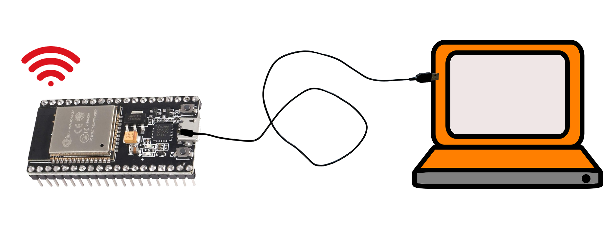

# Secure ESP32 OTA through HTTPS


This page is intended to guide users through the OTA procedure for the ESP32. All referenced OTA projects come from the [ESP-IDF OTA examples](https://github.com/espressif/esp-idf/tree/master/examples/system/ota). The Hello World is from [ESP-IDF gello world project](https://github.com/espressif/esp-idf/tree/master/examples/get-started/hello_world). 

The purpose of OTA is to update the firmware of an IoT device (such as ESP32) remotely and without user interaction. The ESP32 OTA mechanism supports HTTPS to securely transmit firmware over the network. The OTA mechanism can also check the security version of the firmware and compare it with the current version. Then the device may only load the new firmware if it the security version is newer than the current version — a feature known as "anti-rollback".

We will see three examples. Aside from using different APIs, the major differences are that simple_ota_example does not do a version check, native_ota_example does a version check (but not anti-rollback, so older firmware versions can still be downloaded), and advanced_https_ota supports both version check and anti-rollback. advanced_https_ota can also detect if the firmware has not been fully downloaded.

## Introduction

### Workflow
The picture below shows the high-level workflow of an OTA project.
- The laptop runs a web server hosting a new firmware
- The laptop flashes the OTA enabled firmware into the ESP32
- The ESP32 uses the OTA to upgrade its firmware



### Notes

#### Example projects

- The hello world project is in */home/iot/esp/esp-idf/examples/get-started/hello_world*
- All OTA projects are in */home/iot/esp/esp-idf/examples/system/ota*, including simple_ota_example, which we will use.

#### Bridged Adapter for Ubuntu
Before you move forward, make sure the provided Ubuntu VM uses the bridged adapter so that it will get an IP, which will be in the same subnet of our IoT kit. Here is how you configure it:
* VirtualBox Manager -> Ubuntu IoT -> Settings -> Network -> Adapter 1 -> Bridged Adapter

#### Flash size
For each example project, make sure you change the flash size to 4MB since the OTA needs more flash. Here is how you do it with the settings of an example project:
* Settings -> Serial flasher config -> Flash size to 4MB.

#### Simple https web server
We will start a simple https web server using openssl. You can create a folder called "server" within /home/iot. The server folder will host the https web server's private key, self-signed certificate and the firmware for upgrading.

## Prepare the OTA Firmware Images

Build the "Hello World" binary. The binary will be generated in the "build/" directory, under the filename "hello-world.bin". Please copy hello-world.bin to the server directory /home/iot/server.

## Start the Web Server

The next step is to start the web server at our Ubuntu VM. If you are working within a virtual machine (VM) using something like VirtualBox, then you should modify the network settings of your VM to use a bridged adapter rather than NAT (the default) so that the Ubuntu VM and our IoT kit will be in the same subnet. We will use OpenSSL to run a simple HTTPS server on our local machine. Since your ESP32 must be able to access this server, you need to ensure your machine is accessible to the local network and does not block traffic to the chosen HTTP port (in my case, it will be 8070). 

At this point, I would advise you to open a separate terminal window, since this is where the server will be running. First, make a note of your IP address by running the command ```ifconfig```.  Navigate to the "server" directory and generate a server keypair and certificate using the following command 
* ```openssl req -x509 -newkey rsa:2048 -keyout ca_key.pem -out ca_cert.pem -days 365 -nodes```. 

This will generate an RSA keypair and a self-signed server certificate. You will fill out the fields of the certificate. The only field that matters is "Common Name", which **must** match the IP address of your local machine (for example, in my case, the Common Name is "192.168.1.169" because that is my IP address). To run the server on port 8070 using the server certificate, run 
* ```openssl s_server -WWW -key ca_key.pem -cert ca_cert.pem -port 8070```

## Run the simple_ota_example Project

Leave the server running and return to the original terminal. We are going to run the first OTA project now. Navigate to the "simple_ota_example" directory. Make a new directory called "server_certs" under by running ```mkdir server_certs``` if you do not have one . Now copy the server certificate to this new directory by running ```cp ../server/ca_cert.pem server_certs/```. This is necessary to authenticate the server during the TLS handshake.

Open the config menu. Navigate to **Example Configuration** and change **firmware upgrade url endpoint** to "https://_\<your IP\>_:8070/hello-world-unversioned.bin". Navigate to **Example Connection Configuration** and update the WiFi credentials with your SSID and password. Finally, navigate to **Partition Table -> Partition Table** and change it "Factory app, two OTA definitions" if needed. Now exit the configuration and save your changes.

Build, run and flash the firmware. The app will start by running the OTA firmware, which will try to connect to your running HTTPS server. If all goes well, you will see the ESP32 download the "hello-world.bin" firmware, reset the system, and begin running the updated firmware.
